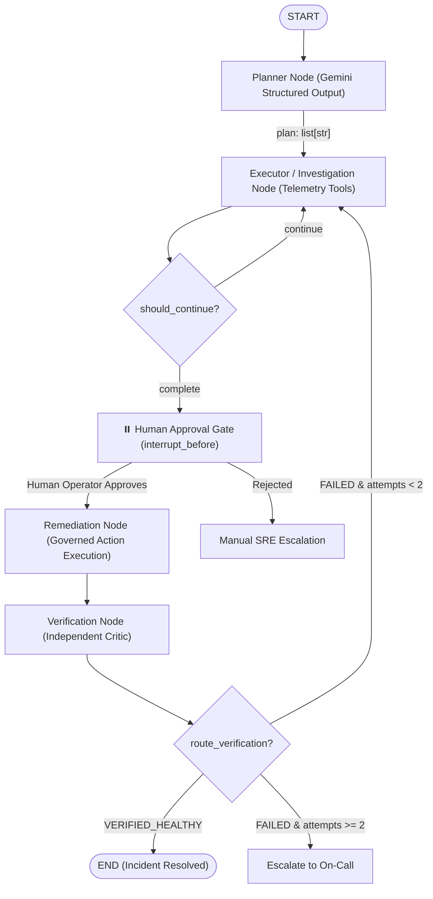

# Enterprise Autonomous Operations Platform
### Multi-Agent Incident Investigation, Governed Remediation & Closed-Loop Verification

[](https://www.python.org/downloads/)
[](https://github.com/langchain-ai/langgraph)
[](https://smith.langchain.com/)
[](tests/)

An enterprise-grade, stateful agentic system built with **LangGraph**, **Google Gemini**, and **LangSmith** designed to autonomously investigate cloud microservice incidents, collect telemetry evidence, diagnose root causes, and execute governed remediations with **Human-in-the-Loop (HITL)** approval gates and **Actor-Critic closed-loop verification**.

---

## 🏛️ Architecture Overview

The system models complex enterprise Site Reliability Engineering (SRE) operations as a **cyclic state machine** rather than an unconstrained autonomous loop or a rigid DAG.



---

## ⚡ Core Engineering Highlights

### 1. Decoupled Plan-and-Solve Paradigm
* **Planner Node:** Uses Gemini (`gemini-1.5-flash` / `gemini-3.1-flash-lite`) with strict Pydantic schemas (`InvestigationPlanSchema`) to formulate discrete diagnostic steps. Mitigates action bias in LLMs.
* **Executor Node:** Dispatches non-destructive, read-only diagnostic tools (`get_service_status`, `query_logs`, `query_metrics`), merges observations into state, and synthesizes a structured root-cause analysis (`RootCauseSchema`).

### 2. Zero-Trust Human Approval Gate (HITL)
* State-changing remediation actions (e.g. `restart_pool`, `scale_memory`, `purge_disk`) can **never run autonomously**.
* Uses LangGraph's native `interrupt_before=['remediation']`. Execution safely halts, state is persisted in storage, and execution only resumes when an authorized human operator invokes the thread.

### 3. Actor-Critic Closed-Loop Verification
* Separates the remediation execution (`remediation_node`) from an independent critic (`verification_node`).
* Re-queries live health telemetry post-remediation to prove the service recovered (latency, replica health, error rates), eliminating LLM self-confirmation bias.
* Automatically triggers secondary investigation or on-call escalation if remediation fails.

### 4. Defense-in-Depth Loop Governance
* Enforces three layers of infinite-loop prevention:
  1. **State-Level Guard:** Explicit `remediation_attempts` counter in `AgentState`.
  2. **Router Escalation:** Halts execution and pages on-call SRE when attempts reach limit.
  3. **Framework Circuit Breaker:** LangGraph's native `recursion_limit` (default 25 super-steps).

### 5. Enterprise Observability & Tracing (LangSmith)
* Distributed tracing integrated into every step. Tracks per-node latency, prompt versions, token consumption, tool payloads, and human wait time in cloud dashboards.

### 6. Automated Benchmark Golden Dataset (CI/CD)
* Includes a 5-scenario evaluation dataset (`data/golden_incidents.json`) testing diverse enterprise failure modes:
  * **Database Pool Starvation:** `payment-service` (Latency spikes, 504 timeouts)
  * **Pod Out of Memory (OOMKilled):** `auth-service` (CrashLoopBackOff, ExitCode 137)
  * **Upstream 3rd-Party Rate Limiting:** `notification-service` (HTTP 429 errors)
  * **Disk Volume Exhaustion:** `analytics-worker` (IOError No space left on device)
  * **False Alarm / Transient Spike:** `order-service` (Healthy telemetry)

---

## 📁 Repository Structure

```
AgentOps/
├── enterprice_ops/
│   ├── app/
│   │   ├── graph/
│   │   │   ├── __init__.py
│   │   │   ├── state.py        # Central TypedDict AgentState & Pydantic schemas
│   │   │   ├── nodes.py        # Planner, Executor, Remediation, Verification nodes
│   │   │   └── graph.py        # StateGraph topology, edges, and checkpointer
│   │   ├── tools/
│   │   │   ├── __init__.py
│   │   │   └── mock_tools.py   # Parameterized telemetry & remediation tools
│   │   └── main.py             # Interactive CLI runner with HITL prompt
│   ├── data/
│   │   └── golden_incidents.json # 5-scenario enterprise benchmark dataset
│   ├── tests/
│   │   ├── __init__.py
│   │   ├── test_graph.py       # 10 core unit tests (state, nodes, HITL, verifier)
│   │   └── test_benchmark_evals.py # Parametrized batch evaluation harness
│   ├── .env                    # API keys & LangSmith tracing configuration
│   └── requirements.txt
└── README.md
```

---

## 🚀 Quickstart & Setup

### 1. Clone & Setup Virtual Environment
```bash
git clone <repo-url>
cd AgentOps/enterprice_ops

python -m venv venv
# On Windows PowerShell:
.\venv\Scripts\activate
# On Linux/macOS:
source venv/bin/activate
```

### 2. Install Dependencies
```bash
pip install -r requirements.txt
pip install langchain-google-genai python-dotenv
```

### 3. Configure Environment Variables
Create or edit `enterprice_ops/.env`:
```env
# LangSmith Tracing
LANGSMITH_TRACING=true
LANGSMITH_ENDPOINT="https://api.smith.langchain.com"
LANGSMITH_API_KEY="your-langsmith-api-key"
LANGSMITH_PROJECT="Enterpriceops"

# Google Gemini LLM
GOOGLE_API_KEY="your-gemini-api-key"
LLM_MODEL="gemini-1.5-flash"
```

---

## 🧪 Testing & Benchmark Verification

### Run the Core Unit Test Suite (10 Tests)
Proves state reducers, node deltas, checkpointers, conditional edges, and HITL gates:
```bash
pytest tests/test_graph.py -v
```
```text
======================== 10 passed in 1.25s ========================
```

### Run the Automated Enterprise Benchmark Suite (5 Incidents)
Runs batch evaluation across all golden incidents in `golden_incidents.json`:
```bash
pytest tests/test_benchmark_evals.py -v
```
```text
tests/test_benchmark_evals.py::test_agent_evaluates_golden_incident[INC-001] PASSED [ 20%]
tests/test_benchmark_evals.py::test_agent_evaluates_golden_incident[INC-002] PASSED [ 40%]
tests/test_benchmark_evals.py::test_agent_evaluates_golden_incident[INC-003] PASSED [ 60%]
tests/test_benchmark_evals.py::test_agent_evaluates_golden_incident[INC-004] PASSED [ 80%]
tests/test_benchmark_evals.py::test_agent_evaluates_golden_incident[INC-005] PASSED [100%]
======================== 5 passed in 8.42s ========================
```

---

## 🖥️ Running the Interactive CLI

```bash
python app/main.py
```

### Example Execution Flow:
```text
********************************************************************************
🚀 ENTERPRISE OPERATIONS INVESTIGATION AGENT (WITH HUMAN APPROVAL GATE)
********************************************************************************

[STAGE 1] Running Autonomous Investigation...

🔍 Collected Evidence So Far:
  • [STATUS] payment-service: UNHEALTHY (Replicas: 1/3)
  • [LOGS] payment-service: Database connection pool exhausted - timeout after 5000ms
  • [METRICS] payment-service db_latency: 4850ms (Alert: CRITICAL)

📄 Diagnosis:
ROOT CAUSE: Database connection exhaustion due to severe backend database latency.

================================================================================
⏸️ GRAPH PAUSED AT HUMAN GATE!
Pending Next Node: ('remediation',)
Proposed Remediation Action: restart_pool:payment-service
================================================================================

[HUMAN OPERATOR] Approve this remediation action? (y/n): y

[STAGE 3] Human approved! Resuming execution...
✅ Remediation Result:
Successfully applied 'restart_pool' to payment-service. Pool cleared, services recovered.

  • [VERIFICATION PASSED] payment-service is HEALTHY (Latency: 28ms, Errors: 0.0%)
```

---

## 🎯 Production Roadmap (Day-2 Deployment)

| Layer | Prototype | Production Cloud Target |
| :--- | :--- | :--- |
| **Persistence** | `MemorySaver` (RAM) | `PostgresSaver` on Amazon RDS / Google Cloud SQL |
| **API Transport** | CLI / stdin | FastAPI microservice with Slack Webhook integration |
| **Telemetry Tools** | Parameterized JSON Mock | Datadog / Prometheus API + Kubernetes Python Client |
| **Guardrails** | Pydantic Schema Validation | NeMo Guardrails / Llama-Guard + RBAC Approval Tokens |

---

## 🎤 Interview Cheatsheet: Key Architectural Questions

1. **Why use LangGraph instead of a simple while loop?**  
   *Native cyclic state modeling, built-in durable persistence across server restarts (checkpointers), time-travel state debugging, and non-blocking human-in-the-loop pause/resume.*
2. **How does state merging work?**  
   *`AgentState` is strictly typed. Nodes only return partial deltas. Accumulating fields (like `observations`) use reducers (`Annotated[List[str], add]`) to prevent state overwriting.*
3. **Why decouple Planner and Executor?**  
   *Eliminates LLM action bias, optimizes token spend (reasoning model for planning, fast execution model for tools), and enables deterministic inspection of the plan before tools execute.*
4. **How does Human-in-the-Loop work without blocking threads?**  
   *`interrupt_before` yields control and freezes state in persistent storage. The process terminates. A webhook resumes the thread asynchronously via `app.invoke(None, config)`.*
5. **Why have a Verification Node?**  
   *Actor-Critic architecture: prevents the remediation agent from suffering confirmation bias by independently verifying post-remediation health telemetry.*
